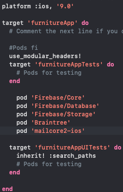

## Setup Instruction

- Clone the repo.
- Install cocoapod using `brew install cocoapods`
- Check cocoapod version `pod --version`
- Setup cocoapod with `pod init`
- Reopen the project which name as ProjName.xcworkspace
- Include any dependency in podfile 
- Make sure setup a firebase account for the back end services. 
